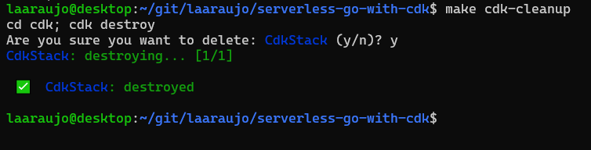

# Hello World - Go Serverless endpoint in AWS

Golang `Hello, World!` app deployed with AWS Lambda function behind AWS API Gateway endpoint via Github Actions.

## Table of contents
* [Pre-requisites](#pre-requisites)
* [Local setup](#local-setup)
* [Manual deployment](#manual-deployment)
* [Cleanup](#cleanup)

## Pre-requisites

* [Node.js](https://nodejs.org/en) (version 20 or higher)
* [Go](https://go.dev/) (version 1.20 or higher)
* AWS CDK CLI [installed and configured](https://docs.aws.amazon.com/cdk/v2/guide/getting_started.html)

## Local setup

Install go package and cdk npm dependencies
```sh
$ make setup
```

To see all available commands go ahead and run
```sh
$ make help
```

```log
setup       : Configure local environment
build       : Build Go package
zip         : Compress Go package for deployment
cdk-deploy  : Deploy latest version through CDK
cleanup     : Clean up cloud environment
```

## Manual deployment

Build the go source code, compress it and deploy it 
```sh
$ make cdk-deploy
```


* Take note of your new endpoint in the CDK Outputs section


## Cleanup
```sh
$ make cdk-cleanup
```


